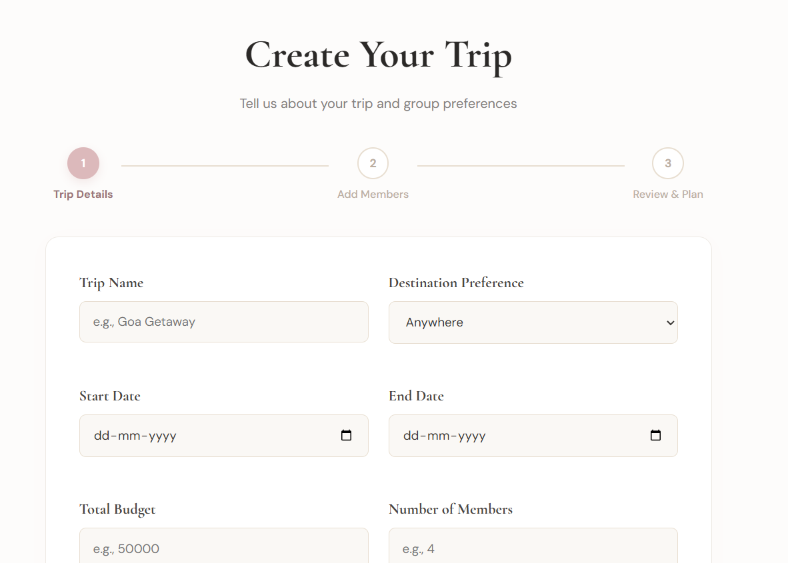
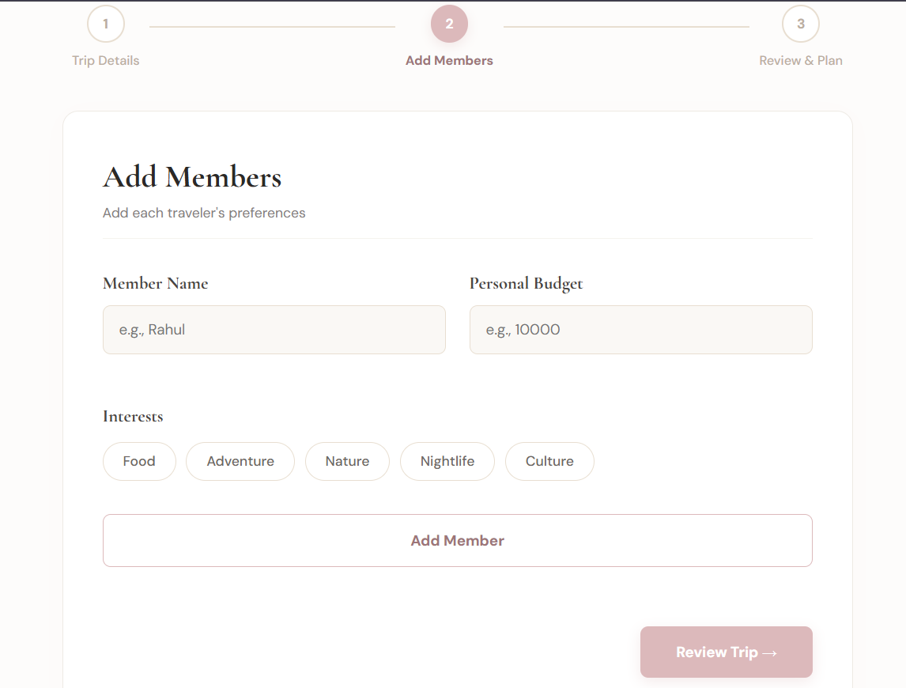
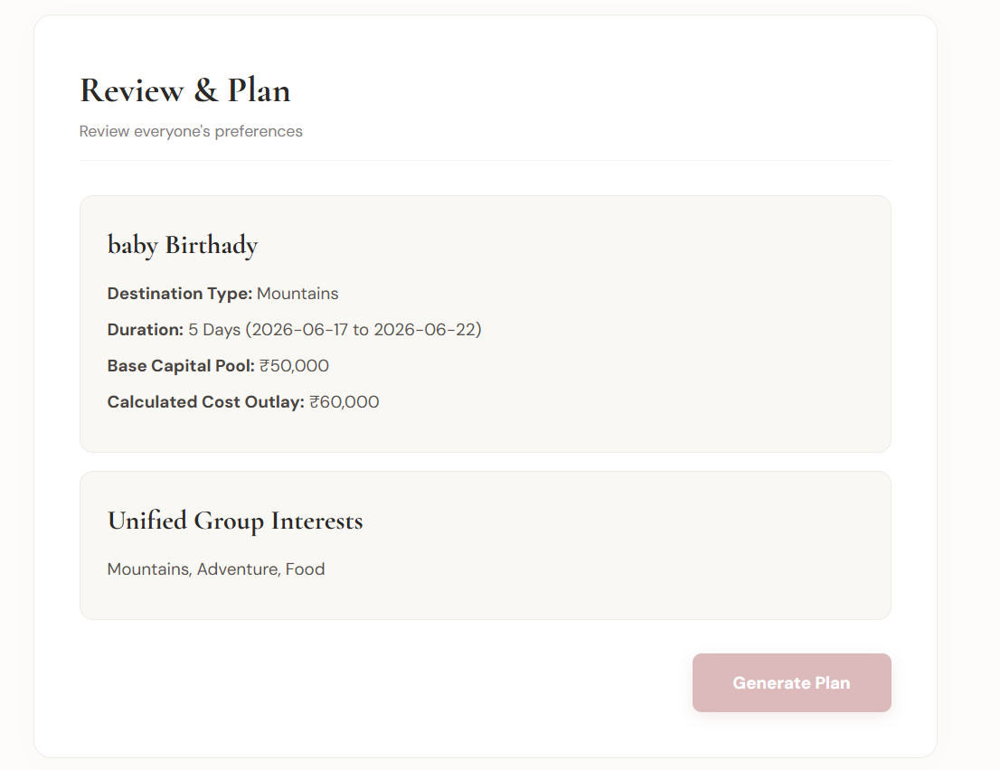

# ✿ Planora — AI-Powered Group Travel Planner

<p align="center">
  
</p>

<p center align="center">
  <strong>Plan together. Decide faster. Travel smarter.</strong>
</p>

<p align="center">
  
  
  
  
</p>

---

## 🌍 Overview

Planning trips with a group is historically chaotic—bogged down by endless chat threads, fragmented budget spreadsheets, and conflicting destination itineraries.

**Planora** structuralises group travel coordination into a unified, AI-driven collaborative ecosystem. It empowers groups to co-create trip scopes, align budgets, vote on tracks dynamically, and deploy hyper-personalised schedules instantly without conversational fatigue.

---

## 🔥 Key Core Systems

### 🤖 LLM-Driven Itinerary Engineering
* **Structured Generation:** Integrates **Gemini 2.5 Flash** using deterministic prompt matrices to generate complete multi-day itineraries parsed into reliable schemas.
* **Deterministic Fallbacks:** Implements structured JSON parsers coupled with algorithmic state-recovering fallbacks to insulate client clients from parsing variations.

### 👥 High-Fidelity Group Collaboration
* **Dynamic Voting Matrix:** Resolves cluster preference friction with weighted recommendation scores for destinations, lodging, and timelines.
* **State Persistence:** Preserves active workspace sessions across components utilising persistent client-side storage layers for frictionless user navigation.

### 💰 Scalable Resource Planning
* **Proportional Allocation:** Computes estimated cost metrics against dynamic traveller sizing algorithms.
* **Granular Tracking:** Breaks down expenditures via an interactive dashboard displaying actual vs. estimated fiscal overviews.

---

## 🖼️ User Interface Preview

| Landing Interface | Workspace Dashboard |
|---|---|
|  |  |

| Operational Hub | Dynamic Review Matrix |
|---|---|
|  |  |

---

## 🛠️ Tech Stack & Architecture

### Production Architecture
* **Interface Layer:** Semantic HTML5, Modular CSS3 Custom Properties, Vanilla JavaScript (ES6+ App Context).
* **AI Orchestration Layer:** Gemini API SDK, Programmatic Structural JSON Handlers.
* **Client Data Pipeline:** Web Storage API (LocalStorage Event Buffering).
---

## 📂 Repository Structure

```text
Planora/
│
├── assets/                 # Images, illustrations, icons, and branding assets
├── css/                    # Global stylesheets and responsive UI components
├── js/                     # Frontend logic, API integrations, and utility scripts
├── pages/                  # Trip creation, review, and planning workflows
├── backend/                # Flask backend services and AI orchestration logic
├── prompts/                # Gemini prompt templates and JSON schemas
├── screenshots/            # README demo images and product previews
├── index.html              # Landing page and application entry point
├── README.md               # Documentation and setup guide
└── LICENSE                 # MIT License
```

## 🚀 Getting Started

### Clone the Repository

```bash
git clone https://github.com/ananditaraj/Planora---AI-Powered-Group-Trip-Planner.git
```

### Navigate to the Project Directory

```bash
cd Planora---AI-Powered-Group-Trip-Planner
```

### Install Frontend Dependencies

```bash
npm install
```

### Install Backend Dependencies

```bash
pip install -r requirements.txt
```

### Configure Environment Variables

Create a `.env` file in the project root:

```env
GEMINI_API_KEY=your_gemini_api_key
```

### Start the Backend Server

```bash
cd backend
python app.py
```

or, if using Flask:

```bash
flask run
```

### Launch the Frontend

Open the application locally using:

```bash
npm start
```

or simply open:

```text
index.html
```

in your browser if no frontend build tool is configured.

---

## 📦 Requirements

### Frontend

- HTML5
- CSS3
- JavaScript (ES6+)
- npm

### Backend

- Python 3.10+
- Flask
- Google Gemini API
- python-dotenv

---

